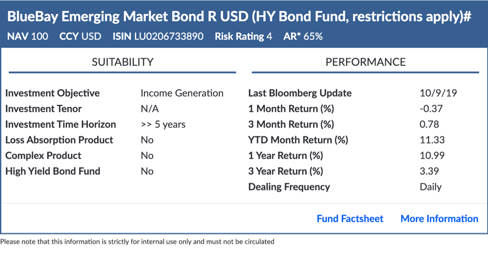

## MI Flashcard Bot
This bot reads off a CSV file as a data store of managed investment products, allowing users to query funds by name or ISIN and obtain a data flashcard of the requested fund.



## Requirements
* Python 3

## Data CSV Fields
The following fields must be present in data csv for the bot to function
* Funds
* Factsheet / Offering Material (via Fundinfo)
* Fund Specific Materials (via Intranet)
* Base Ccy
* Last Bloomberg Update
* Latest NAV
* 1 Mth Return (%)
* 3 Mths Return (%)
* YTD Return (%)
* 1 Yr Return (%)
* 3 Yr Ann Return (%)
* 3 Yr Ann Std Dev (%)
* ISIN (base ccy)
* Is this a High Yield Bond Fund (Yes/No)
* Risk Rating
* AR*
* Investment Objective
* Investment Tenor
* Investment Time Horizon
* Dealing Frequency (Subscription) Refer to Funds Identifier tab for Notice Period
* Loss Absorption Product
* Complex Product
* Extra Remarks

# Configuration
Fill up `resources/config.json` with the appropriate values for pod information,
service account details, data file location and the name of the admin room.
```json5
{
    "sessionAuthHost": "[pod].symphony.com",
    "sessionAuthPort": 443,
    "keyAuthHost": "[pod].symphony.com",
    "keyAuthPort": 443,
    "podHost": "[pod].symphony.com",
    "podPort": 443,
    "agentHost": "[pod].symphony.com",
    "agentPort": 443,
    "authType": "rsa",
    "botPrivateKeyPath": "rsa/",
    "botPrivateKeyName": "rsa-private-mi-flashcard-bot.pem",
    "botUsername": "mi-flashcard-bot",
    "botEmailAddress": "mi-flashcard-bot@bots.symphony.com",
    "truststorePath": "internal_truststore",
    "dataFilePath": "/path/to/data.csv",
    "adminRoomName": "MI Flashcard Bot Admin Room"
}
```
# Deployment
1. For the very first deployment, prepare the environment:
```bash
python -m venv ./venv
source ./venv/bin/activate
pip install -r requirements.txt
```
2. Run the bot: ```python python/main.py```
